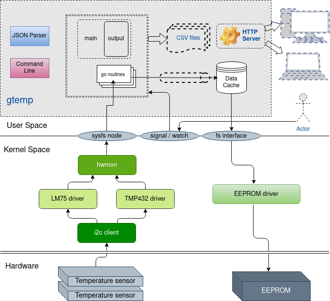

# gtemp
Monitor the thermal and temperature history of your device

- Author:
  -
  Babytech (E-mail:  babytech@126.com)

- Version:
  -
  **0.1.1**

- Requirements
  -
1. For every temperature sensor keep track of the time during which the measurement falls within a specific temperature bracket
2. The abscissa of this histogram will have a granularity not larger than 5-degree and will generate a temperature range from -40c up to the max allowed temperature + time spent beyond these limits
3. The ordinate of this histogram will have a granularity not larger than 30 seconds.
4. This statistical log of the board temperature sensors shall be maintained in non-volatile on-board memory.

- Introduction:
  -
  Monitor the thermal history of the board
1. To monitor the boards and detect hardware problems, temperature sensors on the board are going to be tracked with new application
2. For that, the application should be able to track all temperature sensors on the board. Temperatures should measure periodically on each sensor.
   For instance, every 30 seconds, update a cache in the RAM and do a date file update in EEPROM by the following cases:
   - Every 1 hour
   - Before reboot

  NOTE:
  - This is the standalone application written by golang
  - It provides some functions for temperature statistics from different temperature sensors

- Diagram:
  -

- Usage
  -
  gtemp [-hvVtTrwf] [-s signal] [-j json_file] [-m mount_point] [-p prefix] [-c csv_file] [-d data_file] [-n notify_file] [-e size]

Options:

-T	test JSON configuration, dump it and exit

-V	show version and configure options then exit

-c string

set statistics <product>/<csv_file> as 'input_file' ->[.csv] (default "MF14/temp.csv")

-d string

set data 'input_file' ->[.bin] to generate statistics of history temperature (default "./temp/data.bin")

-e uint

set the raw data size 'n bytes' of persistent storage <eeprom> (default 2048)

-f	write dummy temperature into sensor file period

-h	this help

-j string

set configuration 'input_file' ->[.json]) (default "config.json")

-m string

set mount point path for FUSE (default "/tmp/temp/fuse")

-n string

set notify 'input_file' ->[.txt] to flush data cache to persistent storage <eeprom> (default "./temp/notify.txt")

-p prefix

set prefix path (default "./temp/data/")

-r	read CSV file and exit

-s signal

send signal to a master process: stop, quit, reopen, reload

-t	test JSON configuration and exit

-v	show version and exit

-w	write CSV file and exit

- History
  -
  0.0.1 --- first version to create code framework

  0.0.2 --- provide to generate temperature statics by using web browser tools

  0.0.3 --- support create directory and file if the file is not exist

  0.0.4 --- refactor functions from pass the parameter of global struct to use the object of temp sensor

  0.0.5 --- add test suite to support unit test

  0.0.6 --- provide to generate temperature daily and overall statics

  0.0.7 --- provide to show current temperature of each sensor

  0.0.8 --- support upload csv file to external server

  0.0.9 --- support FUSE function and generate temperature of each sensor as file node on mount directory

  0.1.0 --- support show history temperature from csv file

  0.1.1 --- support http file server and show current temperature on web

